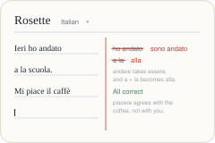

  

# Rosette

  

Didn't work? Create a Mind workspace and paste this to your agent:
` /use-template https://github.com/glennm292/rosette`

## What it is

A two-column notebook for language class: your notes and work on the left,
automatic translations and corrections on the right.

## How to use it

Open the tab and start typing. One line per row -- **Enter** starts the next,
**Shift+Enter** breaks a line without leaving it.

What comes back in the right-hand margin depends on what you wrote:

| You write | You get back |
|---|---|
| `I would like a coffee, please` (English) | `Vorrei un caffè, per favore` -- the natural sentence in your language |
| `Ieri sono andato al mercato` (correct) | **All correct**, with a note on what makes it work |
| `Ieri ho andato a la mercato` (a mistake) | the line in red pen -- ~~ho andato~~ **sono andato**, ~~a la~~ **alla** -- and a sentence or two on why |
| `pentola` (one word) | "saucepan" -- with its gender and how it is actually used |
| `? when do I use the subjunctive after penso` | a direct answer, with an example |

A `?` at the start of a line is what turns it into a question; everything else
is treated as a line of your notebook.

Your notebook persists between sessions, so you can open the same one next
week. Each line costs well under a cent and takes a few seconds.

## About this repository

This repository is a published **minds template**: a clean, bootable
snapshot of what a mind built, ready to adapt into your own. It is NOT the
generic workspace template -- it is this specific project.

[`template.md`](template.md) is the full manifest -- what it is, how it
works, what it needs to run, and what to adapt -- with the
machine-readable half (recipe, requirements, and the environment it needs
installed) in [`template.toml`](template.toml).
